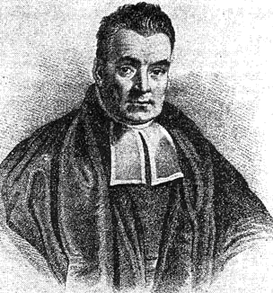

# Probabilism

A growing collection of calculations for rust removal, or perhaps I was just looking for answers. [notes](notes/notes.pdf)

*In Catholic moral theology, probabilism provides a way of answering the question about what to do when one does not know what to do.*

